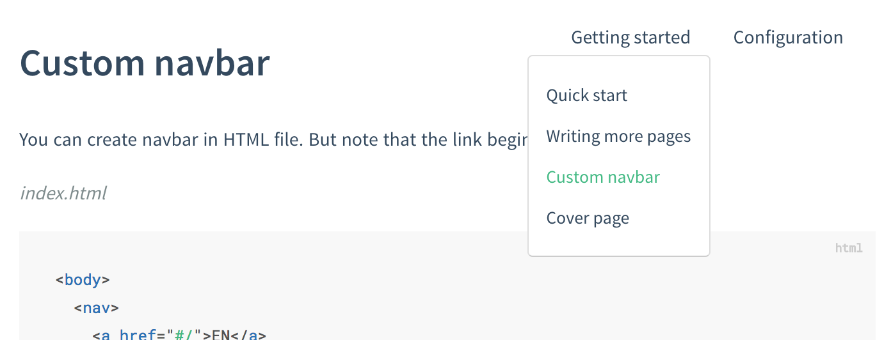

# Custom navbar

## HTML

If you need custom navigation, you can create a HTML-based navigation bar (but note that documentation links begin with `#/`).

```html
<!-- index.html -->

<body>
  <nav>
    <a href="#/">EN</a>
    <a href="#/zh-cn/">中文</a>
  </nav>
  <div id="app"></div>
</body>
```

## Markdown

Alternatively, you can create a custom markdown-based navigation file by setting `loadNavbar` to **true** and creating `_navbar.md`. Details are available in the [load-navbar configuration paragraph](configuration#load-navbar).

```html
<!-- index.html -->

<script>
  window.$docsify = {
    loadNavbar: true
  }
</script>
<script src="//unpkg.com/docsify"></script>
```


```markdown
<!-- _navbar.md -->

- [En](/)
- [chinese](/zh-cn/)
```

!> You need to create a `.nojekyll` in `./docs` to prevent GitHub Pages from ignoring files that begin with an underscore.

`_navbar.md` is loaded from each level directory. If the current directory doesn't have `_navbar.md`, it will fall back to the parent directory. If, for example, the current path is `/guide/quick-start`,  the `_navbar.md` will be loaded from `/guide/_navbar.md`.

## Nesting

You can create sub-lists by indenting items that are under a certain parent.

```markdown
<!-- _navbar.md -->

- Getting started
 - [Quick start](/quickstart)
 - [Writing more pages](/more-pages)
 - [Custom navbar](/custom-navbar)
 - [Cover page](/cover)

- Configuration
  - [Configuration](/configuration)
  - [Themes](/themes)
  - [Using plugins](/plugins)
  - [Markdown configuration](/markdown)
  - [Lanuage highlight](/language-highlight)
```

renders as




