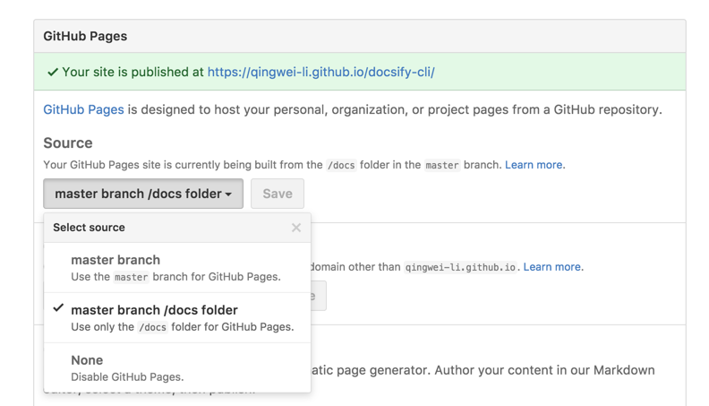

# Deploy

Similar to [GitBook](https://www.gitbook.com), you can deploy files to GitHub Pages, GitLab Pages or VPS.

## GitHub Pages

There are three places to populate your docs for your GitHub repository:

- `docs/` folder
- main branch
- gh-pages branch

It is recommended that you save your files to the `./docs` subfolder of the `main` branch of your repository. Then select `main branch /docs folder` as your GitHub Pages source in your repository's settings page.



!> You can also save files in the root directory and select `main branch`.
You'll need to place a `.nojekyll` file in the deploy location (such as `/docs` or the gh-pages branch)

## GitLab Pages

If you are deploying your master branch, create a `.gitlab-ci.yml` with the following script:

?> The `.public` workaround is so `cp` doesn't also copy `public/` to itself in an infinite loop.

```YAML
pages:
  stage: deploy
  script:
  - mkdir .public
  - cp -r * .public
  - mv .public public
  artifacts:
    paths:
    - public
  only:
  - master
```

!> You can replace script with `- cp -r docs/. public`, if `./docs` is your Docsify subfolder.

## Firebase Hosting

!> You'll need to install the Firebase CLI using `npm i -g firebase-tools` after signing into the [Firebase Console](https://console.firebase.google.com) using a Google Account.

Using a terminal, determine and navigate to the directory for your Firebase Project. This could be `~/Projects/Docs`, etc. From there, run `firebase init` and choose `Hosting` from the menu (use **space** to select, **arrow keys** to change options and **enter** to confirm). Follow the setup instructions.

Your `firebase.json` file should look similar to this (I changed the deployment directory from `public` to `site`):

```json
{
  "hosting": {
    "public": "site",
    "ignore": ["firebase.json", "**/.*", "**/node_modules/**"]
  }
}
```

Once finished, build the starting template by running `docsify init ./site` (replacing site with the deployment directory you determined when running `firebase init` - public by default). Add/edit the documentation, then run `firebase deploy` from the root project directory.

## VPS

Use the following nginx config.

```nginx
server {
  listen 80;
  server_name  your.domain.com;

  location / {
    alias /path/to/dir/of/docs/;
    index index.html;
  }
}
```

## Netlify

1.  Login to your [Netlify](https://www.netlify.com/) account.
2.  In the [dashboard](https://app.netlify.com/) page, click **New site from Git**.
3.  Choose a repository where you store your docs, leave the **Build Command** area blank, and fill in the Publish directory area with the directory of your `index.html`. For example, it should be docs if you populated it at `docs/index.html`.

### HTML5 router

When using the HTML5 router, you need to set up redirect rules that redirect all requests to your `index.html`. It's pretty simple when you're using Netlify. Just create a file named `_redirects` in the docs directory, add this snippet to the file, and you're all set:

```sh
/*    /index.html   200
```

## Vercel

1. Install [Vercel CLI](https://vercel.com/download), `npm i -g vercel`
2. Change directory to your docsify website, for example `cd docs`
3. Deploy with a single command, `vercel`

## AWS Amplify

1. Set the routerMode in the Docsify project `index.html` to *history* mode.

```html
<script>
    window.$docsify = {
      loadSidebar: true,
      routerMode: 'history'
    }
</script>
```

2. Login to your [AWS Console](https://aws.amazon.com).
3. Go to the [AWS Amplify Dashboard](https://aws.amazon.com/amplify).
4. Choose the **Deploy** route to setup your project.
5. When prompted, keep the build settings empty if you're serving your docs within the root directory. If you're serving your docs from a different directory, customise your amplify.yml

```yml
version: 0.1
frontend:
  phases:
    build:
      commands:
        - echo "Nothing to build"
  artifacts:
    baseDirectory: /docs
    files:
      - '**/*'
  cache:
    paths: []

```

6. Add the following Redirect rules in their displayed order. Note that the second record is a PNG image where you can change it with any image format you are using.

| Source address | Target address | Type          |
|----------------|----------------|---------------|
| /<*>.md        | /<*>.md        | 200 (Rewrite) |
| /<*>.png       | /<*>.png       | 200 (Rewrite) |
| /<*>           | /index.html    | 200 (Rewrite) |


## Docker

- Create docsify files

  You need prepare the initial files instead of making them inside the container.
  See the [Quickstart](https://docsify.js.org/#/quickstart) section for instructions on how to create these files manually or using [docsify-cli](https://github.com/docsifyjs/docsify-cli).

    ```sh
    index.html
    README.md
    ```

- Create Dockerfile

  ```Dockerfile
    FROM node:latest
    LABEL description="A demo Dockerfile for build Docsify."
    WORKDIR /docs
    RUN npm install -g docsify-cli@latest
    EXPOSE 3000/tcp
    ENTRYPOINT docsify serve .

  ```

  The current directory structure should be this:

  ```sh
   index.html
   README.md
   Dockerfile
  ```

- Build docker image

  ```sh
  docker build -f Dockerfile -t docsify/demo .
  ```

- Run docker image

  ```sh
  docker run -itp 3000:3000 --name=docsify -v $(pwd):/docs docsify/demo
  ```

